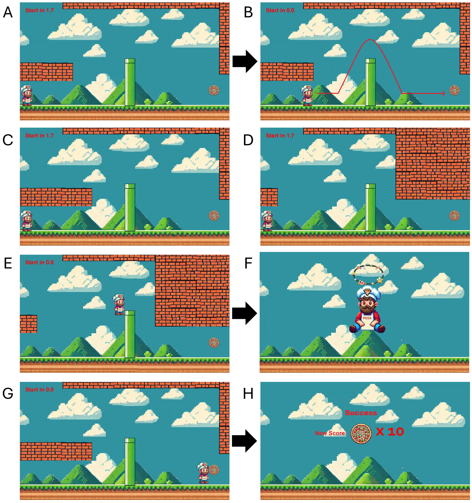

# Welcome to the Git Repo of the YANK Task!
This repo functions to on work and share the Yank Task.  




## Task Description

The **YANK task** is a grip-force-controlled obstacle-avoidance paradigm that contrasts rapid force production (**positive yank**) and rapid force reduction (**negative yank**) under comparable visuomotor demands, within a single event-related fMRI-compatible design. Grip force is continuously quantified on every trial, and wall positions can be adaptively personalised per participant so that task difficulty is matched across individuals and transition directions.

## Features

| Feature | Description |
|---|---|
| Feature One | Short explanation of what it does |
| Feature Two | Short explanation of what it does |
| Feature Three | Short explanation of what it does |

## Hardware and software
 
- **Presentation software:** Python 3.13.3, [Pygame](https://www.pygame.org/) 2.6.1, presented at 1920×1080.
- **Personalisation (outside scanner):** [Vernier Go Direct](https://www.vernier.com/manuals/gdx-hd/) grip-force device (strain-gauge, isometric), sampled at 50 Hz, streamed via USB.
- **fMRI acquisition (in scanner):** MR-compatible [Current Designs Grip Force Bimanual](https://www.curdes.com/mainforp/responsedevices/variabledevices/hhsc-2x1-grfc.html) device (spring-loaded, mechanically compliant), sampled at 180 Hz, interfaced via a Current Designs Birch Optical Interface Unit.

## Installation

In this directory there is a virtual environment (MRI_Env) so that all python packages are not globally installed. 
    This virtual environment is not uploaded to Gitlab. Rather the requiered packages are stored in the requirements.txt file. If there are problems with library versions contact Robert Lubomierski for an updated list of installed libraries. 

```bash
git clone https://github.com/<org>/<repo>.git
cd <repo>
pip install -r requirements.txt
```
 

## Usage

For starting the calibration:
```bash
call MRI_Env\Scripts\activate.bat
python Calibration_Yank_Task.py
```

For starting the MRI task:
```bash
call MRI_Env\Scripts\activate.bat
python MRI_Yank_Task.py
```


## Citation
 
If you use this task, please cite:
 
> _[Add full citation once the manuscript is published, including authors, journal, year, and DOI.]_
 
## Authors
 
Robert Lubomierski, Verena Dzialas and Thilo van Eimeren conceived and developed the YANK task.
 
## License
 
> _Add your chosen license here (e.g. MIT, GPL-3.0) and include a `LICENSE` file in the repository._
 
## Acknowledgements
 
We thank the DoMoCo Team and the CCF Neuro-MRT Team for their technical support.